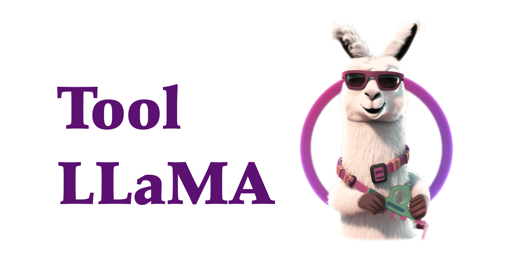

<div align= "center">
    <h1> 🛠️ToolBench🤖</h1>
</div>

<div align="center">


</div>

<p align="center">
  <a href="#model">Model</a> •
  <a href="#data">Data Release</a> •
  <a href="#web-ui">Web Demo</a> •
  <a href="#tooleval">Tool Eval</a> •
  <a href="https://arxiv.org/pdf/2307.16789.pdf">Paper</a> •
  <a href="#citation">Citation</a>

</p>

</div>

<div align="center">

</div>

🔨This project (ToolLLM) aims to construct **open-source, large-scale, high-quality** instruction tuning SFT data to facilitate the construction of powerful LLMs with general **tool-use** capability. We aim to empower open-source LLMs to master thousands of diverse real-world APIs. We achieve this by collecting a high-quality instruction-tuning dataset. It is constructed automatically using the latest ChatGPT (gpt-3.5-turbo-16k), which is upgraded with enhanced [function call](https://openai.com/blog/function-calling-and-other-api-updates) capabilities. We provide the dataset, the corresponding training and evaluation scripts, and a capable model ToolLLaMA fine-tuned on ToolBench.

**2024.8 Update** We have updated the RapidAPI server with a new IP, please make sure you get the latest code. You can also build it locally using codes [here](https://drive.google.com/file/d/1JdbHkL2D8as1docfHyfLWhrhlSP9rZhf/view?usp=sharing).

**💁‍♂️💁💁‍♀️ Join Us on [Discord](https://discord.gg/NScFnpMuRQ)!**

*Read this in [中文](README_ZH.md).*

## What's New
- **[2024/3/17]** Welcome to **[StableToolBench](https://github.com/zhichengg/StableToolBench)**:
A **stable and reliable** local toolbench server based on API response simulation. Dive deeper into the tech behind StableToolBench with [paper here](https://arxiv.org/pdf/2403.07714.pdf) and explore more on the [project homepage](https://zhichengg.github.io/stb.github.io/). Codes are available [here](https://github.com/zhichengg/StableToolBench).

- **[2023/9/29]** A new version ToolEval which is more stable and covers more models including GPT4! Please refer to [**ToolEval**](https://github.com/OpenBMB/ToolBench/tree/master/toolbench/tooleval) for more details. Besides, [**ToolLLaMA-2-7b-v2**](https://huggingface.co/ToolBench/ToolLLaMA-2-7b-v2) is released with stronger tool-use capabilities. Please use the ToolLLaMA-2-7b-v2 model to reproduce our latest experimental results with the new version ToolEval.

- **[2023/8/30]** Data updation, with more than **120,000** solution path annotations and **intact reasoning thoughts**! Please find `data.zip` on [Google Drive](https://drive.google.com/drive/folders/1TysbSWYpP8EioFu9xPJtpbJZMLLmwAmL?usp=drive_link).

- **[2023/8/8]** No more hallucination! [**ToolLLaMA-2-7b-v1**](https://huggingface.co/ToolBench/ToolLLaMA-2-7b-v1) (fine-tuned from LLaMA-2-7b) is released with lower API hallucination than ChatGPT.

- **[2023/8/4]** We provide **RapidAPI backend service** to free you from using your own RapidAPI key and subscribing the APIs. Please fill out our [form](https://forms.gle/S4hqVLtnqeXcNTCJA). We will review it as soon as possible and send you the ToolBench key to get start on it! 

- **[2023/8/1]** Our [**paper**](https://arxiv.org/abs/2307.16789) is released.

- **[2023/7/27]** **New version** ToolBench is released.

✨Here is an overview of the dataset construction, training, and evaluation.

<br>
<div align="center">

</div>
<br>

✨✨Features:
 - **API Collection**: we gather **16464** representational state transfer (REST) APIs from [RapidAPI](https://rapidapi.com/hub), a platform that hosts massive real-world APIs provided by developers.
 - **Instruction Generation**: we curate instructions that involve both **single-tool** and **multi-tool** scenarios.
 - **Answer Annotation**: we develop a novel **depth-first search based decision tree** (DFSDT) to bolster the planning and reasoning ability of LLMs, which significantly improves the annotation efficiency and successfully annotates those complex instructions that cannot be answered with CoT or ReACT. We provide responses that not only include the final answer but also incorporate the model's **reasoning process, tool execution, and tool execution results**. 
 - **API Retriver**: we incorporate API retrieval to equip ToolLLaMA with open-domain tool-using abilities.
 - All the data is automatically generated by OpenAI API and filtered by us, the whole data creation process is easy to scale up.

<br>
<div align="center">

</div>
<br>

We also provide **A demo of using ToolLLaMA**

<div align="center">

https://github.com/OpenBMB/ToolBench/assets/25274507/f1151d85-747b-4fac-92ff-6c790d8d9a31

</div>

Currently, our ToolLLaMA has reached the performance of ChatGPT (turbo-16k) in tool use, in the future, *we will continually improve the data quality and increase the coverage of real-world tools.*

<div align="center">

</div>

Here is the *[Old version](https://github.com/OpenBMB/ToolBench/tree/legacy)* of ToolBench.

## Data

👐ToolBench is intended solely for research and educational purposes and should not be construed as reflecting the opinions or views of the creators, owners, or contributors of this dataset. It is distributed under Apache License 2.0. Below is the statistics of the data :

| Tool Nums | API Nums | Instance Nums | Real API Call | Reasoning Traces |
|-----------|----------|---------------|---------------|------------------|
| 3451      | 16464    | 126486         | 469585         | 4.0              |

We crawl 16000+ real-world APIs from [RapidAPI](https://rapidapi.com/hub), and curate realistic human instructions that involve them. Below we present a hierarchy of RapidAPI and our instruction generation process.

<br>
<div align="center">

</div>
<br>

ToolBench contains both single-tool and multi-tool scenarios. The multi-tool scenarios can be further categorized into intra-category multi-tool and intra-collection multi-tool. We utilize DFSDT method for all scenarios to our data creation. Here is an illustration for the data creation process using DFSDT method:

<div align="center">


</div>

### Data Release

 Please download our dataset using the following link: [Google Drive](https://drive.google.com/drive/folders/1TysbSWYpP8EioFu9xPJtpbJZMLLmwAmL?usp=drive_link) or [Tsinghua Cloud](https://cloud.tsinghua.edu.cn/f/c9e50625743b40bfbe10/). *Notice that `data_0801` is the old version data.*
The file structure is as follows:
```
├── /data/
│  ├── /instruction/
│  ├── /answer/
│  ├── /toolenv/
│  ├── /retrieval/
│  ├── /test_instruction/
│  ├── /test_query_ids/
│  ├── /retrieval_test_query_ids/
│  ├── toolllama_G123_dfs_train.json
│  └── toolllama_G123_dfs_eval.json
├── /reproduction_data/
│  ├── /chatgpt_cot/
│  ├── /chatgpt_dfs/
│  ├── ...
│  └── /toolllama_dfs/
```
Here are some descriptions for the `data` directory:
- `instruction` and `answer`: The instruction data and solution path annotation data. `G1`,`G2`, `G3` refers to single-tool, intra-category multi-tool and intra-collection multi-tool data respectively. We also have an [Atlas Explorer](https://atlas.nomic.ai/map/58aca169-c29a-447a-8f01-0d418fc4d341/030ddad7-5305-461c-ba86-27e1ca79d899) for visualization.
- `toolenv`: The tool environment related data, containing API jsons, API codes and API example responses.
- `retrieval`: The data used for tool retrieval is included in this directory.
- `test_instruction` and `test_query_ids`: We sample 200 instances from every test set. The `test_instruction` directory contains test queries for each test set, and the `test_query_ids` contains query ids of the test instances in each test set.
- `retrieval_test_query_ids`: This directory contains query ids of the test instances for retriever.
- `toolllama_G123_dfs_train.json` and `toolllama_G123_dfs_eval.json`: Preprocessed data that can be used to train toolllama directly and reproduce our results. For preprocessing details, we split the G1, G2 and G3 data into train, eval and test parts respectively and combine the train data for training in our main experiments.

*Please make sure you have downloaded the necessary data and put the directory (e.g. `data/`) under `ToolBench/`, so that the following bash scripts can navigate to the related data.*

## 🤖Model

We release the [ToolLLaMA-2-7b-v2](https://huggingface.co/ToolBench/ToolLLaMA-2-7b-v2) which is trained on the latest version data, and [ToolLLaMA-7b-v1](https://huggingface.co/ToolBench/ToolLLaMA-7b-v1), [ToolLLaMA-7b-LoRA-v1](https://huggingface.co/ToolBench/ToolLLaMA-7b-LoRA-v1) which are trained on the 0801 version data. All models are trained on the released dataset in a multi-task fashion. We also release the [tool retriever](https://huggingface.co/ToolBench/ToolBench_IR_bert_based_uncased) trained under our experimental setting.

## 🚀Fine-tuning
### Install
Clone this repository and navigate to the ToolBench folder.
```bash
git clone git@github.com:OpenBMB/ToolBench.git
cd ToolBench
```
Install Package (python>=3.9)
```bash
pip install -r requirements.txt
```
or for ToolEval only
```bash
pip install -r toolbench/tooleval/requirements.txt
```

Prepare the data and tool environment:
```bash
wget --no-check-certificate 'https://drive.google.com/uc?export=download&id=1XFjDxVZdUY7TXYF2yvzx3pJlS2fy78jk&confirm=yes' -O data.zip
unzip data.zip
```

### Training Retriever
- Data preprocessing:
```bash
export PYTHONPATH=./
python preprocess/preprocess_retriever_data.py \
    --query_file data/instruction/G1_query.json \
    --index_file data/test_query_ids/G1_instruction_test_query_ids.json \
    --dataset_name G1 \
    --output_dir data/retrieval/G1
```
- Then run the following command to train the tool retriever:
```bash
export PYTHONPATH=./
python toolbench/retrieval/train.py \
    --data_path data/retrieval/G1/ \
    --model_name bert-base-uncased \
    --output_path retrieval_model \
    --num_epochs 5 \
    --train_batch_size 32 \
    --learning_rate 2e-5 \
    --warmup_steps 500 \
    --max_seq_length 256
```

### Training ToolLLaMA
- Data preprocessing, for G1_answer as an example:
```bash
export PYTHONPATH=./
python preprocess/preprocess_toolllama_data.py \
    --tool_data_dir data/answer/G1_answer \
    --method DFS_woFilter_w2 \
    --output_file data/answer/toolllama_G1_dfs.json
```
- Our training code is based on [FastChat](https://github.com/lm-sys/FastChat). You can use the following command to train ToolLLaMA-7b with 2 x A100 (80GB), with our preprocessed data `data/toolllama_G123_dfs_train.json`. For preprocessing details, we split the G1, G2 and G3 data into train, eval and test parts respectively and combine the train data for training in our main experiments:
```bash
export PYTHONPATH=./
torchrun --nproc_per_node=2 --master_port=20001 toolbench/train/train_mem.py \
    --model_name_or_path huggyllama/llama-7b  \
    --data_path  data/toolllama_G123_dfs_train.json \
    --eval_data_path  data/toolllama_G123_dfs_eval.json \
    --conv_template tool-llama-single-round \
    --bf16 True \
    --output_dir toolllama \
    --num_train_epochs 2 \
    --per_device_train_batch_size 2 \
    --per_device_eval_batch_size 2 \
    --gradient_accumulation_steps 8 \
    --evaluation_strategy "epoch" \
    --prediction_loss_only \
    --save_strategy "epoch" \
    --save_total_limit 8 \
    --learning_rate 5e-5 \
    --weight_decay 0. \
    --warmup_ratio 0.04 \
    --lr_scheduler_type "cosine" \
    --logging_steps 1 \
    --fsdp "full_shard auto_wrap" \
    --fsdp_transformer_layer_cls_to_wrap 'LlamaDecoderLayer' \
    --tf32 True \
    --source_model_max_length 2048 \
    --model_max_length 8192 \
    --gradient_checkpointing True \
    --lazy_preprocess True \
    --report_to none
```

To train lora version:
```bash
export PYTHONPATH=./
deepspeed --master_port=20001 toolbench/train/train_lora.py \
    --model_name_or_path huggyllama/llama-7b  \
    --data_path  data/toolllama_G123_dfs_train.json \
    --eval_data_path  data/toolllama_G123_dfs_eval.json \
    --conv_template tool-llama-single-round \
    --bf16 True \
    --output_dir toolllama_lora \
    --num_train_epochs 5 \
    --per_device_train_batch_size 4 \
    --per_device_eval_batch_size 2 \
    --gradient_accumulation_steps 2 \
    --evaluation_strategy "epoch" \
    --prediction_loss_only \
    --save_strategy "epoch" \
    --save_total_limit 8 \
    --learning_rate 5e-5 \
    --weight_decay 0. \
    --warmup_ratio 0.04 \
    --lr_scheduler_type "cosine" \
    --logging_steps 1 \
    --source_model_max_length 2048 \
    --model_max_length 8192 \
    --gradient_checkpointing True \
    --lazy_preprocess True \
    --deepspeed ds_configs/stage2.json \
    --report_to none
```


## Inference With Our RapidAPI Server
Please fill out the [form](https://forms.gle/S4hqVLtnqeXcNTCJA) first and after reviewing we will send you the toolbench key. Then prepare your toolbench key by:
```bash
export TOOLBENCH_KEY="your_toolbench_key"
```

### For ToolLLaMA

To inference with ToolLLaMA, run the following commands:
```bash
export PYTHONPATH=./
python toolbench/inference/qa_pipeline.py \
    --tool_root_dir data/toolenv/tools/ \
    --backbone_model toolllama \
    --model_path ToolBench/ToolLLaMA-7b \
    --max_observation_length 1024 \
    --observ_compress_method truncate \
    --method DFS_woFilter_w2 \
    --input_query_file data/test_instruction/G1_instruction.json \
    --output_answer_file toolllama_dfs_inference_result \
    --toolbench_key $TOOLBENCH_KEY
```

For **ToolLLaMA-LoRA**:
```bash
export PYTHONPATH=./
python toolbench/inference/qa_pipeline.py \
    --tool_root_dir data/toolenv/tools/ \
    --backbone_model toolllama \
    --model_path huggyllama/llama-7b \
    --lora \
    --lora_path /path/to/your/downloaded/ToolLLaMA-7b-LoRA \
    --max_observation_length 1024 \
    --observ_compress_method truncate \
    --method DFS_woFilter_w2 \
    --input_query_file data/test_instruction/G1_instruction.json \
    --output_answer_file toolllama_lora_dfs_inference_result \
    --toolbench_key $TOOLBENCH_KEY
```

For ToolLLaMA-LoRA under **open-domain** setting, run:
```bash
export PYTHONPATH=./
python toolbench/inference/qa_pipeline_open_domain.py \
    --tool_root_dir data/toolenv/tools/ \
    --corpus_tsv_path data/retrieval/G1/corpus.tsv \
    --retrieval_model_path /path/to/your/retrival_model \
    --retrieved_api_nums 5 \
    --backbone_model toolllama \
    --model_path huggyllama/llama-7b \
    --lora \
    --lora_path /path/to/your/toolllama_lora \
    --max_observation_length 1024 \
    --observ_compress_method truncate \
    --method DFS_woFilter_w2 \
    --input_query_file data/test_instruction/G1_instruction.json \
    --output_answer_file toolllama_lora_dfs_open_domain_inference_result \
    --toolbench_key $TOOLBENCH_KEY
```

### For OpenAI Models
To use ChatGPT, run:
```bash
export TOOLBENCH_KEY=""
export OPENAI_KEY=""
export PYTHONPATH=./
python toolbench/inference/qa_pipeline.py \
    --tool_root_dir data/toolenv/tools/ \
    --backbone_model chatgpt_function \
    --openai_key $OPENAI_KEY \
    --max_observation_length 1024 \
    --method DFS_woFilter_w2 \
    --input_query_file data/test_instruction/G1_instruction.json \
    --output_answer_file chatgpt_dfs_inference_result \
    --toolbench_key $TOOLBENCH_KEY
```

To use Text-Davinci-003, run:
```bash
export TOOLBENCH_KEY=""
export OPENAI_KEY=""
export PYTHONPATH=./
python toolbench/inference/qa_pipeline.py \
    --tool_root_dir data/toolenv/tools/ \
    --backbone_model davinci \
    --openai_key $OPENAI_KEY \
    --max_observation_length 1024 \
    --method DFS_woFilter_w2 \
    --input_query_file data/test_instruction/G1_instruction.json \
    --output_answer_file davinci_dfs_inference_result \
    --toolbench_key $TOOLBENCH_KEY
```

## Inference With Your Own RapidAPI Account
To do inference with customized RapidAPI account, pass your **rapidapi key** through `rapidapi_key` and specify the `use_rapidapi_key` argument in the script:
```bash
export RAPIDAPI_KEY=""
export OPENAI_KEY=""
export PYTHONPATH=./
python toolbench/inference/qa_pipeline.py \
    --tool_root_dir data/toolenv/tools/ \
    --backbone_model chatgpt_function \
    --openai_key $OPENAI_KEY \
    --max_observation_length 1024 \
    --method DFS_woFilter_w2 \
    --input_query_file data/test_instruction/G1_instruction.json \
    --output_answer_file chatgpt_dfs_inference_result \
    --rapidapi_key $RAPIDAPI_KEY \
    --use_rapidapi_key
```

## API Customization
To do inference with customized API(s), you should prepare the API documentation and code, then modify your query. For example, to add an API **hello_world** which returns a "hello world" string:
- API documentation: First generate the API documentation `hello_world.json`, which should follow this format:
```
{
    "tool_description": "Return hello world.",
    "tool_name": "hello world",
    "title": "hello world",
    "api_list": [
        {
            "name": "get_hello_world",
            "url": "",
            "description": "To get 'hello world'.",
            "method": "GET",
            "required_parameters": [],
            "optional_parameters": []
        }
    ],
    "standardized_name": "hello_world"
}
```
Then put it under a specific category in `data/toolenv/tools/`, either one of the 49 existing categories or a new category, e.g. `Customized`. 
- API code: Create a directory naming the `hello_world` under `Customized` directory. Then write a code `api.py` to realize the function of the API and put it under `Customized/hello_world/`. The API code can be written in this format:
```python
def get_hello_world():
    """
    To get hello world 
    """
    observation = "hello world"
    return observation
```
Now the file structure under `data/toolenv/` should be:
```
├── /tools/
│  ├── /Sports/
│  │  ├── basketball.json
│  │  ├── /basketball/
│  │  │  └── api.py
│  │  └── ...
│  ├── ...
│  ├── /Customized/
│  │  ├── hello_world.json
│  │  ├── /hello_world/
│  │  │  └── api.py
└── response_examples
```
- Modify your query file, and the query file should follow the following format:
```
[
    {
        "query": "I want to get a 'hello world' string.",
        "query_id": 200001,
        "api_list": [
            {
                "category_name": "Customized",
                "tool_name": "hello world",
                "api_name": "get_hello_world"
            }
        ]
    }
]
```
- Finally we are free to inference with the **hello_world** API by running the following commands:
```bash
export PYTHONPATH=./
python toolbench/inference/qa_pipeline.py \
    --tool_root_dir data/toolenv/tools/ \
    --backbone_model toolllama \
    --model_path ToolBench/ToolLLaMA-7b \
    --max_observation_length 1024 \
    --observ_compress_method truncate \
    --method DFS_woFilter_w2 \
    --input_query_file /path/to/your/query/file \
    --output_answer_file /path/to/your/output/file \
    --api_customization
```
*Currently we only support customized API usage under close-domain setting. We plan to support open-domain soon.*


## Setting up and running the interface
ToolBench contains a Web UI based on [Chatbot UI](https://github.com/mckaywrigley/chatbot-ui), forked to include the use of tools in the interface. It comes in two parts: the backend server, and [chatbot-ui-toolllama](https://github.com/lilbillybiscuit/chatbot-ui-toolllama). Here is a [video demo](assets/toolbench-demo.mp4).


### Web UI
```bash
git clone https://github.com/lilbillybiscuit/chatbot-ui-toolllama
cd chatbot-ui-toolllama
npm install
npm run dev
```

The app will be available on `http://localhost:3000/`

### Backend server
```bash
export PYTHONPATH=./
python toolbench/inference/toolbench_server.py \
    --tool_root_dir data/toolenv/tools/ \
    --corpus_tsv_path data/retrieval/G1/corpus.tsv \
    --retrieval_model_path /path/to/your/retrival_model \
    --retrieved_api_nums 5 \
    --backbone_model toolllama \
    --model_path huggyllama/llama-7b \
    --lora \
    --lora_path /path/to/your/toolllama_lora \
    --max_observation_length 1024 \
    --method DFS_woFilter_w2 \
    --input_query_file data/test_instruction/G1_instruction.json \
    --output_answer_file toolllama_lora_dfs_open_domain_result \
    --rapidapi_key $RAPIDAPIKEY
```

This server will be available on `http://localhost:5000/`. To start a request, call `http://localhost:5000/stream` with a GET or POST request containing a JSON object with the following fields:
```json
{
    "text": "What is the weather in New York today?",
    "top_k": 5,
    "method": "DFS_woFilter_w2"
}
```

## ToolEval

By fine-tuning LLaMA on ToolBench, we obtain **ToolLLaMA**. Considering that human evaluation can be time-consuming, we follow [AlpacaEval](https://tatsu-lab.github.io/alpaca_eval/) to develop an efficient machine evaluator **ToolEval**, which incorporates two evaluation metrics:
 - **Pass Rate**: Calculates the proportion of successfully completing an instruction within limited OpenAI API calls. 
 - **Preference**: Measured by comparing two answers (action sequences) for a given instruction. We pre-define a set of criteria for a better answer, which are organized as prompts for ChatGPT. We provide the test instruction and two candidate answers to the evaluator and obtain its preference. We evaluate each answer pair multiple times to improve the reliability of our system. Then we calculate the **Win Rate** (percentage of being preferred by the evaluator). More details can be found in our paper.

To validate the reliability of ChatGPT evaluator in both pass rate and win rate, we sample among four different methods (ChatGPT+ReACT, ChatGPT+DFSDT, ToolLLaMA+DFSDT and GPT4+DFSDT) to obtain solution pairs for 300 test instructions for each method. Then we engage humans to annotate the pass rate for ChatGPT+DFSDT, ToolLLaMA+DFSDT and GPT4+DFSDT, and the win rate among ChatGPT+ReACT and ChatGPT+DFSDT.
Our ChatGPT evaluator demonstrates a high agreement of **87.1%** in pass rate and **80.3%** in win rate with human annotators. This result shows that our evaluator generates highly similar evaluation results to humans and can be viewed as a credible evaluator who simulates human evaluation on pass rate and win rate.

More details about ToolEval can be found in our paper.

### Evaluation with ToolEval
#### Install
Install Package (python>=3.9)
```bash
pip install -r requirements.txt
```

#### Evaluation
*If you want to reproduce the official results, download the reproduction data `reproduction_data.zip` through [Google Drive](), unzip it and put the `reproduction_data` under `ToolBench/data/`, and skip the data preparation process.*
- Data preparation. To evaluate your own model and method using ToolEval, first you need to prepare all the model predictions for the six test subsets. Create a directory naming with your model and method, e.g. `chatgpt_cot` then put each test set's predictions under the directory. The file sturcture of the directory should be:
```
├── /chatgpt_cot/
│  ├── /G1_instruction/
│  │  ├── /10160_CoT@1.json
│  │  └── ...
│  ├── /G1_tool/
│  │  ├── /10221_CoT@1.json
│  │  └── ...
│  ├── ...
│  ├── /G3_instruction/
│  │  ├── /10221_CoT@1.json
│  │  └── ...
```

Then preprocess the predictions by running the following commands:
```bash
export RAW_ANSWER_PATH=../../data/reproduction_data/model_predictions/
export CONVERTED_ANSWER_PATH=../../data/reproduction_data/model_predictions_converted/
export MODEL_NAME=chatgpt_cot
export METHOD=CoT
mkdir ${CONVERTED_ANSWER_PATH}/${MODEL_NAME}
for test_set in G1_instruction G1_category G1_tool G2_category G2_instruction G3_instruction
do
    answer_dir=${RAW_ANSWER_PATH}/${MODEL_NAME}/${test_set}
    output_file=${CONVERTED_ANSWER_PATH}/${MODEL_NAME}/${test_set}.json
    python convert_to_answer_format.py\
        --answer_dir ${answer_dir} \
        --method ${METHOD} \
        --output ${output_file}
done
```
After that, check if there are preprocessed json files for the test sets under `${CONVERTED_ANSWER_PATH}/${MODEL_NAME}`. If so, you're ready to run the following evaluate process. If not, check if there is anything wrong with the model's predictions.

- OpenAI Key. Prepare your openai key to use our evaluator. The key(s) should be stored in a json file, e.g. `path/to/your/openai_key_json_file.json`:
```bash
[
    {
        "username": "your_user_name",
        "passwd": "your_password",
        "api_key": "your_openai_key",
        "organization": "your_organization"
    },
    ...
]
```

- Pass rate:
```bash
export CONVERTED_ANSWER_PATH=../../data/reproduction_data/model_predictions_converted/
export SAVE_PATH=pass_rate_results
export CANDIDATE_MODEL=chatgpt_cot
export API_POOL_FILE=path/to/your/openai_key_json_file.json

python eval_pass_rate.py \
    --converted_answer_path ${CONVERTED_ANSWER_PATH} \
    --save_path ${SAVE_PATH} \
    --reference_model ${CANDIDATE_MODEL} \
    --test_ids ../../data/test_ids/ \
    --max_eval_threads 20 \
    --evaluate_times 7

```
The result files will be stored under the ${SAVE_PATH}.

- Win rate. The below example take ChatGPT-ReACT as reference model and GPT4-ReACT as candidate model. Notice that you need to get both model's pass rate results first, then run the following commands to evaluate the preference result of GPT4-ReACT:
```bash
export CONVERTED_ANSWER_PATH=../../data/reproduction_data/model_predictions_converted/
export SAVE_PATH=preference_results
export PASS_TARE_PATH=pass_rate_results
export REFERENCE_MODEL=chatgpt_cot
export CANDIDATE_MODEL=gpt-4-0613_cot
export API_POOL_FILE=path/to/your/openai_key_json_file.json

python eval_preference.py \
    --converted_answer_path ${CONVERTED_ANSWER_PATH} \
    --reference_model ${REFERENCE_MODEL} \
    --output_model ${CANDIDATE_MODEL} \
    --test_ids ../../data/test_ids/ \
    --save_path ${SAVE_PATH} \
    --pass_rate_result_path ${PASS_TARE_PATH} \
    --max_eval_threads 20 \
    --use_pass_rate true \
    --evaluate_times 7
```
The result files will be stored under the ${SAVE_PATH}.

Please refer to [ToolEval](https://github.com/OpenBMB/ToolBench/tree/master/toolbench/tooleval) for more details.

### 📊 Model Experiments Results


In our main experiments, ToolLLaMA(v2) demonstrates a compelling capability to handle both single-tool and complex multi-tool instructions, which on a par with ChatGPT.
Below are the main results. Win rate for each model is compared with ChatGPT-ReACT.


**Pass Rate:**
| Method | Model               | I1-Inst. | I1-Tool | I1-Cate. | I2-Inst. | I2-Cate. | I3-Inst. | Average |
|--------|---------------------|----------|---------|----------|----------|----------|----------|---------|
| ReACT  | Claude-2            | 5.5      | 3.5     | 5.5      | 6        | 6        | 14       | 6.8     |
|        | Text-Davinci-003    | 12       | 20      | 20       | 8.5      | 14.5     | 24       | 16.5    |
|        | ChatGPT             | 41.5     | 44      | 44.5     | 42.5     | 46.5     | 22       | 40.2    |
|        | ToolLLaMA           | 25       | 29      | 33       | 30.5     | 31.5     | 25       | 29      |
|        | GPT4                | 53.5       | 50.0    | 53.5       | 67.0     | 72.0     | 47.0       | 57.2    |
| DFSDT  | Claude-2            | 20.5     | 31      | 18.5     | 17       | 20.5     | 28       | 22.6    |
|        | Text-Davinci-003    | 43.5     | 44      | 46       | 37       | 42       | 46       | 43.1    |
|        | ChatGPT             | 54.5     | 65      | 60.5     | 75       | 71.5     | 62       | 64.8    |
|        | ToolLLaMA           | 57       | 61      | 62       | 77       | 77       | 66       | 66.7    |
|        | ToolLLaMA-Retreiver | **64**       | 64      | 60.5     | **81.5**     | 68.5     | 65       | 67.3    |
|        | GPT4                | 60       | **71.5**    | **67**       | 79.5     | **77.5**     | **71**       | **71.1**    |


**Win Rate:** (Reference model: ChatGPT-ReACT)
| Method | Model               | I1-Inst. | I1-Tool | I1-Cate. | I2-Inst. | I2-Cate. | I3-Inst. | Average |
|--------|---------------------|----------|---------|----------|----------|----------|----------|---------|
| ReACT  | Claude-2            | 31       | 27.8    | 33.8     | 35       | 31.5     | 47.5     | 34.4    |
|        | Text-Davinci-003    | 28.5     | 35.3    | 31       | 29.8     | 29.8     | 45       | 33.2    |
|        | ToolLLaMA           | 45       | 42      | 47.5     | 50.8     | 41.8     | 55       | 47      |
|        | GPT4                | 60       | 58.8    | 63.5     | 65.8     | 60.3     | 78       | 64.4    |
| DFSDT  | Claude-2            | 38       | 44.3    | 43.3     | 36.8     | 33.5     | 65       | 43.5    |
|        | Text-Davinci-003    | 40.3     | 43.8    | 46.8     | 40.5     | 43.3     | 63       | 46.3    |
|        | ChatGPT             | 60.5     | 62      | 57.3     | 72       | **64.8**     | 69       | 64.3    |
|        | ToolLLaMA           | 55       | 55.3    | 54.5     | 68.5     | 58       | 69       | 60      |
|        | ToolLLaMA-Retreiver | 62.3     | 59      | 55       | 68.5     | 60.8     | 73       | 63.1    |
|        | GPT4                | **67.5**     | **67.8**    | **66.5**     | **73.3**     | 63.3     | **84**       | **70.4**    |


## TODO
- [ ] ToolLLaMA will reach GPT-4's tool-use capability.

## Resources of Tool Learning

With the powerful capabilities of foundation models, we are eager to see their applications in manipulating various tools. For more resources, please refer to the following:

- **BMTools**. [[Project](https://github.com/OpenBMB/BMTools)]

- **Tool Learning Survey**. [[Paper](https://arxiv.org/abs/2304.08354)]
  
- **Tool Learning Paper List**. [[Project](https://github.com/thunlp/ToolLearningPapers)]

- **WebCPM**. [[Paper](https://github.com/thunlp/WebCPM)]


## Citation
Feel free to cite us if you like ToolBench.
```bibtex
@misc{qin2023toolllm,
      title={ToolLLM: Facilitating Large Language Models to Master 16000+ Real-world APIs}, 
      author={Yujia Qin and Shihao Liang and Yining Ye and Kunlun Zhu and Lan Yan and Yaxi Lu and Yankai Lin and Xin Cong and Xiangru Tang and Bill Qian and Sihan Zhao and Runchu Tian and Ruobing Xie and Jie Zhou and Mark Gerstein and Dahai Li and Zhiyuan Liu and Maosong Sun},
      year={2023},
      eprint={2307.16789},
      archivePrefix={arXiv},
      primaryClass={cs.AI}
}
```

```bibtex
@misc{qin2023tool,
      title={Tool Learning with Foundation Models}, 
      author={Yujia Qin and Shengding Hu and Yankai Lin and Weize Chen and Ning Ding and Ganqu Cui and Zheni Zeng and Yufei Huang and Chaojun Xiao and Chi Han and Yi Ren Fung and Yusheng Su and Huadong Wang and Cheng Qian and Runchu Tian and Kunlun Zhu and Shihao Liang and Xingyu Shen and Bokai Xu and Zhen Zhang and Yining Ye and Bowen Li and Ziwei Tang and Jing Yi and Yuzhang Zhu and Zhenning Dai and Lan Yan and Xin Cong and Yaxi Lu and Weilin Zhao and Yuxiang Huang and Junxi Yan and Xu Han and Xian Sun and Dahai Li and Jason Phang and Cheng Yang and Tongshuang Wu and Heng Ji and Zhiyuan Liu and Maosong Sun},
      year={2023},
      eprint={2304.08354},
      archivePrefix={arXiv},
      primaryClass={cs.CL}
}
```

```bibtex
@misc{guo2024stabletoolbench,
      title={StableToolBench: Towards Stable Large-Scale Benchmarking on Tool Learning of Large Language Models},
      author={Guo, Zhicheng and Cheng, Sijie and Wang, Hao and Liang, Shihao and Qin, Yujia and Li, Peng and Liu, Zhiyuan and Sun, Maosong and Liu, Yang},
      year={2024},
      eprint={2403.07714},
      archivePrefix={arXiv},
      primaryClass={cs.CL}
}
```
