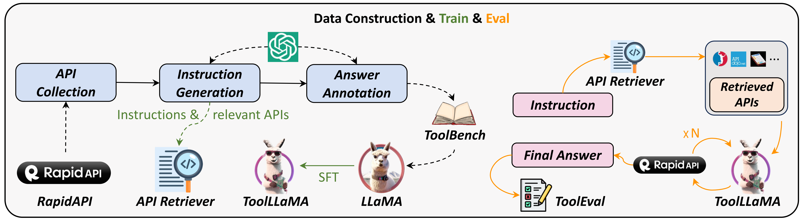
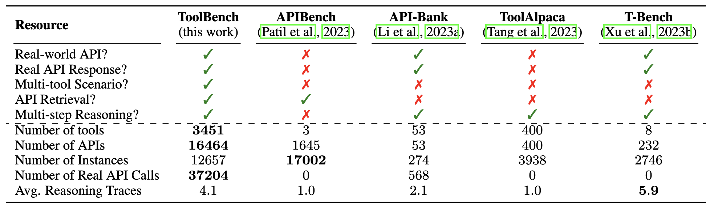
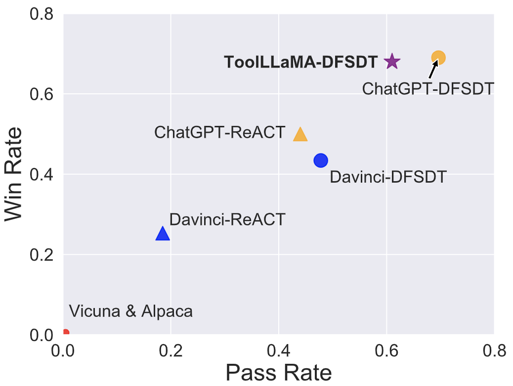
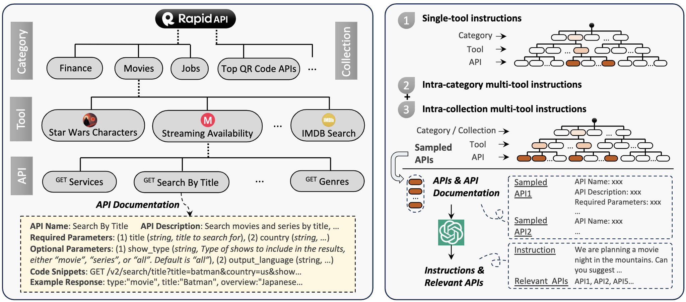
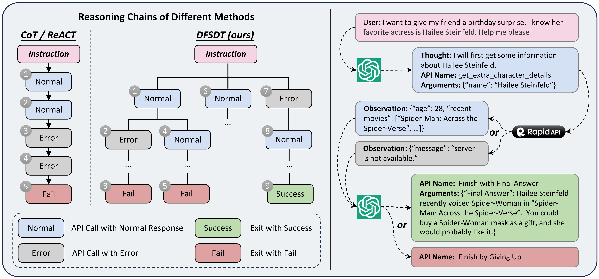

<div align= "center">
    <h1> 🛠️ToolBench🤖</h1>
</div>

<div align="center">


</div>

<p align="center">
  <a href="#model">Model</a> •
  <a href="#data">Data Release</a> •
  <a href="#web-ui">Web Demo</a> •
  <a href="#tool-eval">Tool Eval</a> •
  <a href="assets/paper.pdf">Paper</a> •
  <a href="#citation">Citation</a>

</p>

</div>

<div align="center">

</div>

🔨这个项目(ToolLLM)旨在构建**开源、大规模、高质量**的指令调整 SFT 数据，以促进构建具有通用工具使用能力的强大LLMs。我们的目标是赋予开源 LLMs 掌握成千上万多样的真实世界API能力。我们通过收集高质量的指令调整数据集来实现这一目标。该数据集使用最新的ChatGPT（gpt-3.5-turbo-16k）自动构建，该版本升级了增强的函数调用功能。我们提供数据集、相应的训练和评估脚本，以及在ToolBench上经过微调的强大模型ToolLLaMA。

**💁‍♂️💁💁‍♀️在 [Discord](https://discord.gg/NScFnpMuRQ) 加入我们!**

*英文[README](README.md)链接.*

## 最新支持
- **[2023/9/29]** 更稳定的更新版本**ToolEval**， 加上更多模型比如GPT4的结果！更多细节请参考[ToolEval](https://github.com/OpenBMB/ToolBench/tree/master/toolbench/tooleval). 除此之外，工具使用能力更强的[**ToolLLaMA-2-7b-v2**](https://huggingface.co/ToolBench/ToolLLaMA-2-7b-v2)模型已经开放，请使用这版模型和更新的tooleval来复现最新的实验结果。

- **[2023/8/30]** 数据更新，拥有超过**12万**解路径标注和**完整的推理thoughts**！请在 [Google Drive](https://drive.google.com/drive/folders/1TysbSWYpP8EioFu9xPJtpbJZMLLmwAmL?usp=drive_link) 上找到`data.zip`。

- **[2023/8/8]** 告别幻觉！[**ToolLLaMA-2-7b-v1**](https://huggingface.co/ToolBench/ToolLLaMA-2-7b-v1) (从LLaMA-2-7b微调而来)模型已发布，比ChatGPT有着更少的API幻觉现象.

- **[2023/8/4]** 我们提供RapidAPI后端服务，以免您使用自己的RapidAPI私钥去订阅API。填写[表单](https://forms.gle/S4hqVLtnqeXcNTCJA)后，我们会尽快审核并给您发送ToolBench key去请求该后端服务! 

- **[2023/8/1]** 我们的[论文](https://arxiv.org/abs/2307.16789)正式发布.

- **[2023/7/27]** 新版本ToolBench更新.

✨以下是数据集构建方法、模型训练、评测的整体概览

<br>
<div align="center">

</div>
<br>

✨✨特点:
 - API收集: 我们从 RapidAPI 收集了 16464 个API。RapidAPI 是一个托管开发者提供的大规模真实世界API的平台。

 - 指令生成: 我们生成了涉及单工具和多工具场景的指令。

 - 答案标注: 我们设计了一种新颖的深度优先搜索决策树方法（DFSDT），以增强LLMs的规划和推理能力。这显著提高了标注效率，并成功地对那些不能用CoT或ReACT回答的复杂指令进行了标注。我们提供的回答不仅包括最终答案，还包括模型的推理过程、工具执行和工具执行结果。

 - API Retriever: 我们整合了API检索模块，为ToolLLaMA提供了开放域的工具使用能力。

 - 所有数据均由OpenAI API自动生成并由我们筛选，整个数据创建过程易于扩展。

<br>
<div align="center">

</div>
<br>

以下是**ToolLLaMA的demo展示**

<div align="center">

https://github.com/OpenBMB/ToolBench/assets/25274507/f1151d85-747b-4fac-92ff-6c790d8d9a31

</div>

目前，我们的ToolLLaMA已经达到了和ChatGPT（turbo-16k）接近的工具使用能力，未来*我们将不断进行数据的后处理与清洗，以提高数据质量并增加真实世界工具的覆盖范围。*

<div align="center">

</div>

这是*[老版本](https://github.com/OpenBMB/ToolBench/tree/legacy)*的ToolBench。
<!-- 💁‍♂️💁💁‍♀️**We need your help!** Curating large-scale real-world APIs and their corresponding tool-use SFT data is not easy, we sincerely invite you to join us in building and refining ToolBench. We will list all participants as co-authors in the final paper. Please contact and join [us](mailto:yujiaqin16@gmail.com) if you're interested. -->

## 🗒️数据

👐ToolBench仅用于研究和教育目的，不应被视为反映此数据集的创作者、所有者或贡献者的观点或意见。该数据集以 Apache License 2.0 许可证 进行分发。以下是数据集的统计信息:

| 工具数量 | API数量 | 实例数量 | 真实API调用数量 | 平均Reasoning步数 |
|-----------|----------|---------------|---------------|------------------|
| 3451      | 16464    | 126486         | 469585         | 4.0              |

我们从[RapidAPI](https://rapidapi.com/hub)爬取了超过16000个API，并且为之构造了真实的人类指令。以下是RapidAPI的架构信息与指令构造的方式。

<br>
<div align="center">

</div>
<br>


ToolBench包含单工具和多工具场景。多工具场景可以进一步分为类别内多工具和集合内多工具。我们在数据创建过程中使用DFSDT方法。以下是使用DFSDT方法进行数据创建的说明：

<div align="center">



</div>

### 数据发布

 请使用以下链接下载我们的数据集：[Google Drive](https://drive.google.com/drive/folders/1TysbSWYpP8EioFu9xPJtpbJZMLLmwAmL?usp=drive_link)或者[清华云盘](https://cloud.tsinghua.edu.cn/f/c9e50625743b40bfbe10/).*请注意：`data_0801.zip`是老版本数据。*
文件结构如下:
```
├── /data/
│  ├── /instruction/
│  ├── /answer/
│  ├── /toolenv/
│  ├── /retrieval/
│  ├── /test_instruction/
│  ├── /test_query_ids/
│  ├── /retrieval_test_query_ids/
│  ├── toolllama_G123_dfs_train.json
│  └── toolllama_G123_dfs_eval.json
├── /reproduction_data/
│  ├── /chatgpt_cot/
│  ├── /chatgpt_dfs/
│  ├── ...
│  └── /toolllama_dfs/
```
以下是`data`目录的一些描述：
- `instruction` 和 `answer`：指令数据和解决方案路径标注数据。 `G1`、`G2`、`G3`分别指单工具、类内多工具和集合内多工具数据。我们还有一个用于可视化的 [Atlas Explorer](https://atlas.nomic.ai/map/58aca169-c29a-447a-8f01-0d418fc4d341/030ddad7-5305-461c-ba86-27e1ca79d899)。
- `toolenv`：工具环境相关数据，包含API json、API代码和API示例返回。
- `retrieval`：用于工具检索的数据包含在此目录中。
- `test_instruction` and `test_query_ids`：我们从每个测试集中抽取 200 个实例。该目录包含每个测试集中测试实例的queries和query id。
- `retrieval_test_query_ids`：该目录包含检索器测试实例的query id。
- `toolllama_G123_dfs_train.json` 和 `toolllama_G123_dfs_eval.json`：预处理数据，可用于直接训练 toolllama 并复现我们的结果。对于预处理细节，我们将 G1、G2 和 G3 数据分别分为训练、评估和测试部分，合并各数据集的训练数据进行训练。

## 🤖模型
我们发布了在最新数据上全参数微调的[ToolLLaMA-2-7b-v2](https://huggingface.co/ToolBench/ToolLLaMA-2-7b-v2)，还有在0801版本数据上全参数微调的[ToolLLaMA-7b-v1](https://huggingface.co/ToolBench/ToolLLaMA-7b-v1)和lora版本[ToolLLaMA-7b-LoRA-v1](https://huggingface.co/ToolBench/ToolLLaMA-7b-LoRA-v1)，所有模型都是以多任务方式训练的。我们也发布在实验设置下训练的[tool retriever](https://huggingface.co/ToolBench/ToolBench_IR_bert_based_uncased).
## 🚀精调
### 安装
克隆这个仓库并进入ToolBench文件夹。
```bash
git clone git@github.com:OpenBMB/ToolBench.git
cd ToolBench
```
安装包 (python>=3.9)
```bash
pip install -r requirements.txt
```
或者仅安装ToolEval需要的包
```bash
pip install -r toolbench/tooleval/requirements.txt
```

准备数据和工具环境:
```bash
wget --no-check-certificate 'https://drive.google.com/uc?export=download&id=1XFjDxVZdUY7TXYF2yvzx3pJlS2fy78jk&confirm=yes' -O data.zip
unzip data.zip
```


### 训练Retriever
- 数据预处理:
```bash
export PYTHONPATH=./
python preprocess/preprocess_retriever_data.py \
    --query_file data/instruction/G1_query.json \
    --index_file data/test_query_ids/G1_instruction_test_query_ids.json \
    --dataset_name G1 \
    --output_dir data/retrieval/G1
```
- 使用以下命令训练Retriever:
```bash
export PYTHONPATH=./
python toolbench/retrieval/train.py \
    --data_path data/retrieval/G1/ \
    --model_name bert-base-uncased \
    --output_path retrieval_model \
    --num_epochs 5 \
    --train_batch_size 32 \
    --learning_rate 2e-5 \
    --warmup_steps 500 \
    --max_seq_length 256
```

### 训练ToolLLaMA
- 数据预处理（G1_answer为例子）:
```bash
export PYTHONPATH=./
python preprocess/preprocess_toolllama_data.py \
    --tool_data_dir data/answer/G1_answer \
    --method DFS_woFilter_w2 \
    --output_file data/answer/toolllama_G1_dfs.json
```
- 我们的训练代码基于[FastChat](https://github.com/lm-sys/FastChat)开发.您可以使用以下命令用两张A100（80G）以及我们预处理好的数据`data/toolllama_G123_dfs_train.json`或data_0830版本`data_0830/toolllama_G123_dfs_train_0830.json`来训练 ToolLLaMA-7b。对于预处理细节，我们将 G1、G2 和 G3 数据分别分为训练、评估和测试部分，合并各数据集中的训练数据进行训练:
```bash
export PYTHONPATH=./
torchrun --nproc_per_node=2 --master_port=20001 toolbench/train/train_mem.py \
    --model_name_or_path huggyllama/llama-7b  \
    --data_path  data/toolllama_G123_dfs_train.json \
    --eval_data_path  data/toolllama_G123_dfs_eval.json \
    --conv_template tool-llama-single-round \
    --bf16 True \
    --output_dir toolllama \
    --num_train_epochs 2 \
    --per_device_train_batch_size 2 \
    --per_device_eval_batch_size 2 \
    --gradient_accumulation_steps 8 \
    --evaluation_strategy "epoch" \
    --prediction_loss_only \
    --save_strategy "epoch" \
    --save_total_limit 8 \
    --learning_rate 5e-5 \
    --weight_decay 0. \
    --warmup_ratio 0.04 \
    --lr_scheduler_type "cosine" \
    --logging_steps 1 \
    --fsdp "full_shard auto_wrap" \
    --fsdp_transformer_layer_cls_to_wrap 'LlamaDecoderLayer' \
    --tf32 True \
    --source_model_max_length 2048 \
    --model_max_length 8192 \
    --gradient_checkpointing True \
    --lazy_preprocess True \
    --report_to none
```

您也可以用以下命令用您自己的方式去预处理并划分数据:
```bash
export PYTHONPATH=./
python preprocess/preprocess_toolllama_data.py \
    --tool_data_dir data/answer/G1_answer \
    --method DFS_woFilter_w2 \
    --output_file data/answer/toolllama_G1_dfs.json
```


训练lora版本:
```bash
export PYTHONPATH=./
deepspeed --master_port=20001 toolbench/train/train_lora.py \
    --model_name_or_path huggyllama/llama-7b  \
    --data_path  data/toolllama_G123_dfs_train.json \
    --eval_data_path  data/toolllama_G123_dfs_eval.json \
    --conv_template tool-llama-single-round \
    --bf16 True \
    --output_dir toolllama_lora \
    --num_train_epochs 5 \
    --per_device_train_batch_size 4 \
    --per_device_eval_batch_size 2 \
    --gradient_accumulation_steps 2 \
    --evaluation_strategy "epoch" \
    --prediction_loss_only \
    --save_strategy "epoch" \
    --save_total_limit 8 \
    --learning_rate 5e-5 \
    --weight_decay 0. \
    --warmup_ratio 0.04 \
    --lr_scheduler_type "cosine" \
    --logging_steps 1 \
    --source_model_max_length 2048 \
    --model_max_length 8192 \
    --gradient_checkpointing True \
    --lazy_preprocess True \
    --deepspeed ds_configs/stage2.json \
    --report_to none
```


## 用我们的RapidAPI服务进行推理
请先填写[问卷](https://forms.gle/S4hqVLtnqeXcNTCJA)，我们会尽快审核然后给您发送toolbench key。然后初始化您的toolbench key:
```bash
export TOOLBENCH_KEY="your_toolbench_key"
```
### ToolLLaMA
用以下命令用ToolLLaMA做推理:
```bash
export PYTHONPATH=./
python toolbench/inference/qa_pipeline.py \
    --tool_root_dir data/toolenv/tools/ \
    --backbone_model toolllama \
    --model_path /path/to/your/toolllama \
    --max_observation_length 1024 \
    --observ_compress_method truncate \
    --method DFS_woFilter_w2 \
    --input_query_file data/test_instruction/G1_instruction.json \
    --output_answer_file toolllama_dfs_inference_result \
    --toolbench_key $TOOLBENCH_KEY
```

**lora**版本的inference:
```bash
export PYTHONPATH=./
python toolbench/inference/qa_pipeline.py \
    --tool_root_dir data/toolenv/tools/ \
    --backbone_model toolllama \
    --model_path huggyllama/llama-7b \
    --lora \
    --lora_path /path/to/your/toolllama_lora \
    --max_observation_length 1024 \
    --observ_compress_method truncate \
    --method DFS_woFilter_w2 \
    --input_query_file data/test_instruction/G1_instruction.json \
    --output_answer_file toolllama_lora_dfs_inference_result \
    --toolbench_key $TOOLBENCH_KEY
```

lora版本的**开放域**, 用以下命令:
```bash
export PYTHONPATH=./
python toolbench/inference/qa_pipeline_open_domain.py \
    --tool_root_dir data/toolenv/tools/ \
    --corpus_tsv_path data/retrieval/G1/corpus.tsv \
    --retrieval_model_path /path/to/your/retrival_model \
    --retrieved_api_nums 5 \
    --backbone_model toolllama \
    --model_path huggyllama/llama-7b \
    --lora \
    --lora_path /path/to/your/toolllama_lora \
    --max_observation_length 1024 \
    --observ_compress_method truncate \
    --method DFS_woFilter_w2 \
    --input_query_file data/test_instruction/G1_instruction.json \
    --output_answer_file toolllama_lora_dfs_open_domain_inference_result \
    --toolbench_key $TOOLBENCH_KEY
```
### OpenAI模型
用ChatGPT:
```bash
export TOOLBENCH_KEY=""
export OPENAI_KEY=""
export PYTHONPATH=./
python toolbench/inference/qa_pipeline.py \
    --tool_root_dir data/toolenv/tools/ \
    --backbone_model chatgpt_function \
    --openai_key $OPENAI_KEY \
    --max_observation_length 1024 \
    --method DFS_woFilter_w2 \
    --input_query_file data/test_instruction/G1_instruction.json \
    --output_answer_file chatgpt_dfs_inference_result \
    --toolbench_key $TOOLBENCH_KEY
```

用Text-Davinci-003:
```bash
export TOOLBENCH_KEY=""
export OPENAI_KEY=""
export PYTHONPATH=./
python toolbench/inference/qa_pipeline.py \
    --tool_root_dir data/toolenv/tools/ \
    --backbone_model davinci \
    --openai_key $OPENAI_KEY \
    --max_observation_length 1024 \
    --method DFS_woFilter_w2 \
    --input_query_file data/test_instruction/G1_instruction.json \
    --output_answer_file davinci_dfs_inference_result \
    --toolbench_key $TOOLBENCH_KEY
```

## 用您自己的RapidAPI账号做推理
要用定制化的RapidAPI账号进行推理，请在脚本中传入您的**rapidapi key**并指定`use_rapidapi_key`参数:
```bash
export RAPIDAPI_KEY=""
export OPENAI_KEY=""
export PYTHONPATH=./
python toolbench/inference/qa_pipeline.py \
    --tool_root_dir data/toolenv/tools/ \
    --backbone_model chatgpt_function \
    --openai_key $OPENAI_KEY \
    --max_observation_length 1024 \
    --method DFS_woFilter_w2 \
    --input_query_file data/test_instruction/G1_instruction.json \
    --output_answer_file chatgpt_dfs_inference_result \
    --rapidapi_key $RAPIDAPI_KEY \
    --use_rapidapi_key
```


## 自定义API做推理
要使用自定义API进行推理，您需要准备API文档和代码，然后修改您的query文件。例如，要添加**hello_world** API，该API的功能为返回“hello world”字符串：
- API文档：首先生成API文档json文件（`hello_world.json`），该文件应遵循以下格式：
```
{
    "tool_description": "Return hello world.",
    "tool_name": "hello world",
    "title": "hello world",
    "api_list": [
        {
            "name": "get_hello_world",
            "url": "",
            "description": "To get 'hello world'.",
            "method": "GET",
            "required_parameters": [],
            "optional_parameters": []
        }
    ],
    "standardized_name": "hello_world"
}
```
然后将其放在“data/toolenv/tools/”中的某个category下，可以是已有的49个现有类别之一，也可以新创建一个类别，例如`Customized`。
- API代码：在`Customized`文件夹下创建一个名为`hello_world`的文件夹，然后编写实现API功能的代码`api.py`并将其放在`Customized/hello_world/`下。 API代码可以写成这样的格式：
```python
def get_hello_world():
    """
    To get hello world 
    """
    observation = "hello world"
    return observation
```
现在 `data/toolenv/` 下的文件结构应该是：
```
├── /tools/
│  ├── /Sports/
│  │  ├── basketball.json
│  │  ├── /basketball/
│  │  │  └── api.py
│  │  └── ...
│  ├── ...
│  ├── /Customized/
│  │  ├── hello_world.json
│  │  ├── /hello_world/
│  │  │  └── api.py
└── response_examples
```
- 修改您的query文件，查询文件应遵循以下格式：
```
[
    {
        "query": "I want to get a 'hello world' string.",
        "query_id": 200001,
        "api_list": [
            {
                "category_name": "Customized",
                "tool_name": "hello world",
                "api_name": "get_hello_world"
            }
        ]
    }
]
```
- 最后，我们可以通过运行以下命令来使用自定义的**hello_world**API进行推理：
```bash
export PYTHONPATH=./
python toolbench/inference/qa_pipeline.py \
    --tool_root_dir data/toolenv/tools/ \
    --backbone_model toolllama \
    --model_path ToolBench/ToolLLaMA-7b \
    --max_observation_length 1024 \
    --observ_compress_method truncate \
    --method DFS_woFilter_w2 \
    --input_query_file /path/to/your/query/file \
    --output_answer_file /path/to/your/output/file \
    --api_customization
```
*Currently we only support customized API usage under close-domain setting. We plan to support open-domain soon.*

## Setting up and running the interface

ToolBench包含一个基于[Chatbot UI](https://github.com/mckaywrigley/chatbot-ui)的Web UI，经过修改以包含在界面中使用工具的功能。它包含两个部分：后端服务器和[chatbot-ui-toolllama](https://github.com/lilbillybiscuit/chatbot-ui-toolllama)。这是一个[视频演示](assets/toolbench-demo.mp4)。

### Web UI
```bash
git clone https://github.com/lilbillybiscuit/chatbot-ui-toolllama
cd chatbot-ui-toolllama
npm install
npm run dev
```

应用将在 http://localhost:3000/ 上可用

### Backend server
```bash
export PYTHONPATH=./
python toolbench/inference/toolbench_server.py \
    --tool_root_dir data/toolenv/tools/ \
    --corpus_tsv_path data/retrieval/G1/corpus.tsv \
    --retrieval_model_path /path/to/your/retrival_model \
    --retrieved_api_nums 5 \
    --backbone_model toolllama \
    --model_path huggyllama/llama-7b \
    --lora \
    --lora_path /path/to/your/toolllama_lora \
    --max_observation_length 1024 \
    --method DFS_woFilter_w2 \
    --input_query_file data/test_instruction/G1_instruction.json \
    --output_answer_file data/answer/toolllama_lora_dfs_open_domain \
    --rapidapi_key $RAPIDAPIKEY
```

This server will be available on `http://localhost:5000/`. To start a request, call `http://localhost:5000/stream` with a GET or POST request containing a JSON object with the following fields:
```json
{
    "text": "What is the weather in New York today?",
    "top_k": 5,
    "method": "DFS_woFilter_w2"
}
```


## ToolEval

通过在ToolBench上对LLaMA进行微调，我们得到了**ToolLLaMA**。考虑到人工评估非常耗时，我们借鉴[AlpacaEval](https://tatsu-lab.github.io/alpaca_eval/)开发了一个高效的机器自动评估**ToolEval**，其中包含两个评估指标：

- **通过率**：计算在有限的OpenAI API调用次数内成功完成指令的比例。

- **偏好**：通过比较给定指令的两个答案（动作序列）来衡量。我们预先定义了一组更好答案的标准，这些标准被组织成ChatGPT的提示。我们向评估器提供测试指令和两个候选答案，并获得其偏好。我们对每个答案对进行多次评估以提高系统的可靠性。然后，我们计算**优胜率**（被评估器选择为更优的百分比）。有关详细信息，请参阅我们的论文。

为了验证ChatGPT评估器在通过率和胜率方面的可靠性，我们从四种不同的方法（ChatGPT+ReACT，ChatGPT+DFSDT，ToolLLaMA+DFSDT和GPT4+DFSDT）中进行采样，为每种方法的300个测试指令获取解决方案对。然后，我们请人类标注ChatGPT+DFSDT，ToolLLaMA+DFSDT和GPT4+DFSDT的通过率，以及ChatGPT+ReACT和ChatGPT+DFSDT之间的胜率。

我们的ChatGPT评估器在通过率方面与人类标注者具有高达**87.1%**的一致性，在胜率方面具有**80.3%**的一致性。这个结果表明，我们的评估器生成的评估结果与人类非常相似，并且可以视为在通过率和胜率上模拟人类评估的可靠评估器。

有关ToolEval的更多细节，请参阅我们的论文。


### Evaluation with ToolEval
*若要复现结果，直接通过[Google Drive](https://drive.google.com/drive/folders/1TysbSWYpP8EioFu9xPJtpbJZMLLmwAmL?usp=drive_link)下载我们的`reproduction_data.zip`，解压后置`reproduction_data`于`ToolBench/data/`下即可，可以跳过数据准备流程。*
- 数据准备。若要使用 ToolEval 评估您自己的模型和方法，首先需要为六个测试子集准备所有的模型预测。创建一个以您的模型和方法命名的目录，例如 `chatgpt_cot`，然后将每个测试集的预测放在该目录下。目录的文件结构应如下：
```
├── /chatgpt_cot/
│  ├── /G1_instruction/
│  │  ├── /10160_CoT@1.json
│  │  └── ...
│  ├── /G1_tool/
│  │  ├── /10221_CoT@1.json
│  │  └── ...
│  ├── ...
│  ├── /G3_instruction/
│  │  ├── /10221_CoT@1.json
│  │  └── ...
```

然后对模型预测进行预处理:

```bash
export RAW_ANSWER_PATH=../../data/reproduction_data/model_predictions/
export CONVERTED_ANSWER_PATH=../../data/reproduction_data/model_predictions_converted/
export MODEL_NAME=chatgpt_cot
export METHOD=CoT
mkdir ${CONVERTED_ANSWER_PATH}/${MODEL_NAME}
for test_set in G1_instruction G1_category G1_tool G2_category G2_instruction G3_instruction
do
    answer_dir=${RAW_ANSWER_PATH}/${MODEL_NAME}/${test_set}
    output_file=${CONVERTED_ANSWER_PATH}/${MODEL_NAME}/${test_set}.json
    python convert_to_answer_format.py\
        --answer_dir ${answer_dir} \
        --method ${METHOD} \
        --output ${output_file}
done
```
之后，检查`${CONVERTED_ANSWER_PATH}/${MODEL_NAME}`下是否有测试集的预处理JSON文件。如果有，你就可以准备运行以下评估过程了。如果没有，请检查模型的预测是否有问题。

- OpenAI Key
准备您的OpenAI Key来搭建我们的evaluator。Key需要被存储到一个json file中，如`path/to/your/openai_key_json_file.json`：
```bash
[
    {
        "username": "your_user_name",
        "passwd": "your_password",
        "api_key": "your_openai_key",
        "organization": "your_organization"
    },
    ...
]
```
- Pass rate.
```bash
export CONVERTED_ANSWER_PATH=../../data/reproduction_data/model_predictions_converted/
export SAVE_PATH=pass_rate_results
export CANDIDATE_MODEL=chatgpt_cot
export API_POOL_FILE=path/to/your/openai_key_json_file.json

python eval_pass_rate.py \
    --converted_answer_path ${CONVERTED_ANSWER_PATH} \
    --save_path ${SAVE_PATH} \
    --reference_model ${CANDIDATE_MODEL} \
    --test_ids ../../data/test_query_ids/ \
    --max_eval_threads 20 \
    --evaluate_times 7

```

结果文件会被存储至${SAVE_PATH}中。

- Win rate. 以下示例以ChatGPT-ReACT作为参考模型，GPT4-ReACT作为候选模型。请注意，您首先需要获取两个模型的pass rate结果，然后运行以下命令来评估GPT4-ReACT的win rate结果:
```bash
export CONVERTED_ANSWER_PATH=../../data/reproduction_data/model_predictions_converted/
export SAVE_PATH=preference_results
export PASS_TARE_PATH=pass_rate_results
export REFERENCE_MODEL=chatgpt_cot
export CANDIDATE_MODEL=gpt-4-0613_cot
export API_POOL_FILE=path/to/your/openai_key_json_file.json

python eval_preference.py \
    --converted_answer_path ${CONVERTED_ANSWER_PATH} \
    --reference_model ${REFERENCE_MODEL} \
    --output_model ${CANDIDATE_MODEL} \
    --test_ids ../../data/test_query_ids/ \
    --save_path ${SAVE_PATH} \
    --pass_rate_result_path ${PASS_TARE_PATH} \
    --max_eval_threads 20 \
    --use_pass_rate true \
    --evaluate_times 7
```

结果文件会被存储至${SAVE_PATH}中。

更多细节请参考 [ToolEval](https://github.com/OpenBMB/ToolBench/blob/master/toolbench/tooleval/README_ZH.md).


### Model Experiment

在我们的主要实验中，ToolLLaMA展现了处理单一工具和复杂多工具指令的引人注目的能力，与ChatGPT的能力相当。以下是主要的实验结果，其中win rate的参考模型是ChatGPT-ReACT.

**Pass Rate:**
| Method | Model               | I1-Inst. | I1-Tool | I1-Cate. | I2-Inst. | I2-Cate. | I3-Inst. | Average |
|--------|---------------------|----------|---------|----------|----------|----------|----------|---------|
| ReACT  | Claude-2            | 5.5      | 3.5     | 5.5      | 6        | 6        | 14       | 6.8     |
|        | Text-Davinci-003    | 12       | 20      | 20       | 8.5      | 14.5     | 24       | 16.5    |
|        | ChatGPT             | 41.5     | 44      | 44.5     | 42.5     | 46.5     | 22       | 40.2    |
|        | ToolLLaMA           | 25       | 29      | 33       | 30.5     | 31.5     | 25       | 29      |
|        | GPT4                | 53.5       | 50.0    | 53.5       | 67.0     | 72.0     | 47.0       | 57.2    |
| DFSDT  | Claude-2            | 20.5     | 31      | 18.5     | 17       | 20.5     | 28       | 22.6    |
|        | Text-Davinci-003    | 43.5     | 44      | 46       | 37       | 42       | 46       | 43.1    |
|        | ChatGPT             | 54.5     | 65      | 60.5     | 75       | 71.5     | 62       | 64.8    |
|        | ToolLLaMA           | 57       | 61      | 62       | 77       | 77       | 66       | 66.7    |
|        | ToolLLaMA-Retreiver | **64**       | 64      | 60.5     | **81.5**     | 68.5     | 65       | 67.3    |
|        | GPT4                | 60       | **71.5**    | **67**       | 79.5     | **77.5**     | **71**       | **71.1**    |


**Win Rate:** (Reference model: ChatGPT-ReACT)
| Method | Model               | I1-Inst. | I1-Tool | I1-Cate. | I2-Inst. | I2-Cate. | I3-Inst. | Average |
|--------|---------------------|----------|---------|----------|----------|----------|----------|---------|
| ReACT  | Claude-2            | 31       | 27.8    | 33.8     | 35       | 31.5     | 47.5     | 34.4    |
|        | Text-Davinci-003    | 28.5     | 35.3    | 31       | 29.8     | 29.8     | 45       | 33.2    |
|        | ToolLLaMA           | 45       | 42      | 47.5     | 50.8     | 41.8     | 55       | 47      |
|        | GPT4                | 60       | 58.8    | 63.5     | 65.8     | 60.3     | 78       | 64.4    |
| DFSDT  | Claude-2            | 38       | 44.3    | 43.3     | 36.8     | 33.5     | 65       | 43.5    |
|        | Text-Davinci-003    | 40.3     | 43.8    | 46.8     | 40.5     | 43.3     | 63       | 46.3    |
|        | ChatGPT             | 60.5     | 62      | 57.3     | 72       | **64.8**     | 69       | 64.3    |
|        | ToolLLaMA           | 55       | 55.3    | 54.5     | 68.5     | 58       | 69       | 60      |
|        | ToolLLaMA-Retreiver | 62.3     | 59      | 55       | 68.5     | 60.8     | 73       | 63.1    |
|        | GPT4                | **67.5**     | **67.8**    | **66.5**     | **73.3**     | 63.3     | **84**       | **70.4**    |

## TODO
- [ ] 更新使用更新数据（data-0830 版本）训练的 ToolLLaMA 结果。
- [ ] ToolLLaMA将达到GPT-4的工具使用能力。

## 工具学习相关链接

鉴于基础模型的强大能力，我们期待看到它们在操纵各种工具中的应用。更多的资源，请参考以下内容：

- **BMTools**. [[Project](https://github.com/OpenBMB/BMTools)]

- **Tool Learning Survey**. [[Paper](https://arxiv.org/abs/2304.08354)]
  
- **Tool Learning Paper List**. [[Project](https://github.com/thunlp/ToolLearningPapers)]

- **WebCPM**. [[Paper](https://github.com/thunlp/WebCPM)]

## Citation
如果您对ToolBench感兴趣，欢迎引用我们的工作。
```bibtex
@misc{qin2023toolllm,
      title={ToolLLM: Facilitating Large Language Models to Master 16000+ Real-world APIs}, 
      author={Yujia Qin and Shihao Liang and Yining Ye and Kunlun Zhu and Lan Yan and Yaxi Lu and Yankai Lin and Xin Cong and Xiangru Tang and Bill Qian and Sihan Zhao and Runchu Tian and Ruobing Xie and Jie Zhou and Mark Gerstein and Dahai Li and Zhiyuan Liu and Maosong Sun},
      year={2023},
      eprint={2307.16789},
      archivePrefix={arXiv},
      primaryClass={cs.AI}
}
```

```bibtex
@misc{qin2023tool,
      title={Tool Learning with Foundation Models}, 
      author={Yujia Qin and Shengding Hu and Yankai Lin and Weize Chen and Ning Ding and Ganqu Cui and Zheni Zeng and Yufei Huang and Chaojun Xiao and Chi Han and Yi Ren Fung and Yusheng Su and Huadong Wang and Cheng Qian and Runchu Tian and Kunlun Zhu and Shihao Liang and Xingyu Shen and Bokai Xu and Zhen Zhang and Yining Ye and Bowen Li and Ziwei Tang and Jing Yi and Yuzhang Zhu and Zhenning Dai and Lan Yan and Xin Cong and Yaxi Lu and Weilin Zhao and Yuxiang Huang and Junxi Yan and Xu Han and Xian Sun and Dahai Li and Jason Phang and Cheng Yang and Tongshuang Wu and Heng Ji and Zhiyuan Liu and Maosong Sun},
      year={2023},
      eprint={2304.08354},
      archivePrefix={arXiv},
      primaryClass={cs.CL}
}
```
